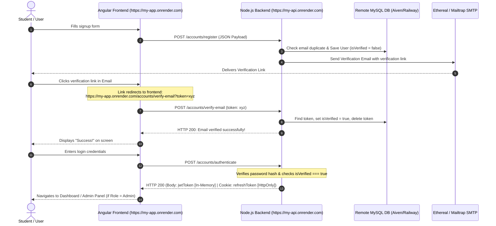

# Full-Stack Authentication System Deployment Guide
## Final Project & Examination Requirements

This guide provides a detailed blueprint for configuring, deploying, and integrating your **Node.js + MySQL Backend** and **Angular 21 Frontend** in accordance with the final examination requirements.

---

## 📋 Table of Contents
1. [GitHub Repository Audit & Security Best Practices](#1-github-repository-audit--security-best-practices)
2. [Backend Deployment (Node.js + MySQL)](#2-backend-deployment-nodejs--mysql)
3. [Frontend Deployment (Angular 21)](#3-frontend-deployment-angular-21)
4. [How Frontend & Backend Merge (Integration Architecture)](#4-how-frontend--backend-merge-integration-architecture)
5. [Evaluation Stage Checklists (Stage A & Stage B)](#5-evaluation-stage-checklists-stage-a--stage-b)

---

## 1. GitHub Repository Audit & Security Best Practices

Per the instructor's requirements, you must host your project across **two distinct GitHub repositories**:
1. **Backend Repository** (Node.js + Express)
2. **Frontend Repository** (Angular 21)

### 🔒 Security & Secrets Management (No Hardcoded Secrets)
Never commit secrets, passwords, or keys to GitHub. Follow these rules:

#### A. Create a `.gitignore` File
Ensure your backend has a `.gitignore` file to prevent environment configs and SQLite local databases from being pushed:
```ignore
# Dependency directories
node_modules/

# Environment configurations
.env
config.json

# Local SQLite databases
*.sqlite
database.sqlite

# System and editor logs
npm-debug.log*
.vscode/
.idea/
```

#### B. Setup Environment Variables
Replace hardcoded credentials with environment variables (`process.env.VARIABLE_NAME`). Here is the standard environment template for your backend:

Create a `.env.example` in the backend root to show required variables without revealing secrets:
```env
# Server Port
PORT=4000
NODE_ENV=production

# Database Configuration (MySQL)
DB_HOST=your-remote-db-host.com
DB_PORT=3306
DB_USER=your_db_username
DB_PASSWORD=your_db_password
DB_NAME=your_database_name

# Security
JWT_SECRET=your-super-long-secure-jwt-secret-key-here

# Email Verification (SMTP)
SMTP_HOST=smtp.ethereal.email
SMTP_PORT=587
SMTP_USER=your_smtp_username
SMTP_PASS=your_smtp_password
EMAIL_FROM=noreply@yourdomain.com

# CORS Configuration
CORS_ORIGIN=https://your-angular-frontend-url.onrender.com
```

---

## 2. Backend Deployment (Node.js + MySQL)

### 🗄️ Database Connectivity (SQLite vs. MySQL Switch)
In development, it is common to use local SQLite for speed. In production, Sequelize must connect to your remote MySQL server. 

We can configure `_helpers/db.ts` to automatically choose between SQLite (local dev) and MySQL (production/deployed env):

```typescript
import { Sequelize, Options } from 'sequelize';
import accountModel from '../accounts/account.model';
import refreshTokenModel from '../accounts/refresh-token.model';

const db: any = {};
export default db;

initialize();

async function initialize() {
    let sequelize: Sequelize;

    // Dynamically choose between remote MySQL and local SQLite
    if (process.env.NODE_ENV === 'production' || process.env.DB_HOST) {
        console.log('Connecting to remote MySQL database...');
        const dbOptions: Options = {
            dialect: 'mysql',
            host: process.env.DB_HOST || 'localhost',
            port: parseInt(process.env.DB_PORT || '3306'),
            username: process.env.DB_USER || 'root',
            password: process.env.DB_PASSWORD || '',
            database: process.env.DB_NAME || 'node_mysql_api',
            logging: false,
            dialectOptions: {
                // Required by some cloud hosting services (e.g. Aiven, AWS RDS) for SSL
                ssl: process.env.DB_SSL === 'true' ? { rejectUnauthorized: false } : false
            }
        };
        sequelize = new Sequelize(dbOptions);
    } else {
        console.log('Connecting to local SQLite database...');
        sequelize = new Sequelize({
            dialect: 'sqlite',
            storage: './database.sqlite',
            logging: false
        });
    }

    // Initialize models
    db.Account = accountModel(sequelize);
    db.RefreshToken = refreshTokenModel(sequelize);

    // Define relationships
    db.Account.hasMany(db.RefreshToken, { onDelete: 'CASCADE' });
    db.RefreshToken.belongsTo(db.Account);

    // Sync models with database
    await sequelize.sync();
    console.log('Database synchronization complete.');
}
```

### 📖 Activating `/api-docs` (Swagger) Route
To make the `/api-docs` route active and testable in production, install `swagger-ui-express` and `yamljs`, then load your `swagger.yaml` document dynamically:

In `server.ts`:
```typescript
import swaggerUi from 'swagger-ui-express';
import YAML from 'yamljs';
const swaggerDocument = YAML.load('./swagger.yaml');

// Serve interactive Swagger API docs
app.use('/api-docs', swaggerUi.serve, swaggerUi.setup(swaggerDocument));
```

### 🌐 Dynamic CORS & Cookie Config
Ensure cookies and headers can be sent securely between your domains.
In `server.ts`:
```typescript
const allowedOrigin = process.env.CORS_ORIGIN || 'http://localhost:4200';

app.use(cors({
    origin: (origin, callback) => {
        // Allow requests with no origin (like mobile apps, curl, or swagger)
        if (!origin || origin === allowedOrigin || process.env.NODE_ENV !== 'production') {
            callback(null, true);
        } else {
            callback(new Error('Not allowed by CORS'));
        }
    },
    credentials: true
}));
```

---

## 3. Frontend Deployment (Angular 21)

Your frontend must be compiled as a production SPA and deployed to a static/frontend host (e.g., Render static site, Vercel, Netlify, or Firebase Hosting).

### ⚙️ Production Environment Config (`environment.prod.ts`)
Configure your Angular environment files to swap the base API URL dynamically depending on the build type.

1. **`src/environments/environment.ts` (Development)**
   ```typescript
   export const environment = {
     production: false,
     apiUrl: 'http://localhost:4000',
     useFakeBackend: false // Switch to true for Stage A testing
   };
   ```

2. **`src/environments/environment.prod.ts` (Production)**
   ```typescript
   export const environment = {
     production: true,
     apiUrl: 'https://your-node-backend-url.onrender.com', // Your deployed API URL
     useFakeBackend: false
   };
   ```

### 🏗️ Compiling the Production Build
Run the production build command inside your Angular directory:
```bash
ng build --configuration production
```
This builds highly optimized HTML, JS, and CSS files in the `dist/` folder ready to serve.

### 🔀 The Critical Routing Rewrite Rule (Render, Vercel, Netlify)
Since Angular is a Single Page Application (SPA), the browser handles routing internally. If you refresh the page on a deep link like `/accounts/verify-email?token=...`, the hosting provider's server looks for a file at that path on the server, fails to find it, and returns a **404 Error**.

To fix this on hosting platforms like **Render**, you must configure a **Rewrite Rule**:

| Setting | Value |
| :--- | :--- |
| **Source** | `/*` |
| **Destination** | `/index.html` |
| **Action** | `Rewrite` |

- **Render**: Navigate to your Static Site dashboard -> **Redirects/Rewrites** -> Add Rule. Set **Source** as `/*`, **Destination** as `/index.html`, and **Action** as `Rewrite`.
- **Netlify**: Create a `_redirects` file in your `src/` directory (ensure it is copied to the dist folder via `angular.json` assets):
  ```text
  /*    /index.html   200
  ```
- **Vercel**: Add a `vercel.json` file in your root:
  ```json
  {
    "rewrites": [{ "source": "/(.*)", "destination": "/index.html" }]
  }
  ```

---

## 4. How Frontend & Backend Merge (Integration Architecture)

When we talk about "merging" a separate backend and frontend, we do not literally merge their codebases into a single repository for deployment (especially since the instructor requires **two distinct repositories**). 

Instead, "merging" refers to **Integration**—making the two isolated systems work together seamlessly across the internet.

Here is a visual map of the integration:



### 🗝️ Core Mechanics of the Integration

1. **API Requests**: The Angular frontend uses the standard `HttpClient` module. All HTTP calls are sent to the URL configured in `environment.apiUrl`.
2. **CORS (Cross-Origin Resource Sharing)**: Because the frontend (`https://my-app.onrender.com`) and backend (`https://my-api.onrender.com`) have different domains, the browser blocks requests by default. The Backend enables CORS explicitly for the frontend URL and allows `credentials: true`.
3. **Secure Cookie Credentials**: 
   - **`jwtToken`**: Kept in memory (Angular state) to prevent XSS (Cross-Site Scripting) theft. It is sent in the `Authorization: Bearer <token>` header for subsequent API calls.
   - **`refreshToken`**: Stored in a secure cookie with the `HttpOnly` and `Secure` attributes. The browser sends it automatically with credentials when hitting `/accounts/refresh-token`, ensuring the user stays logged in securely without exposing tokens to JavaScript.

---

## 5. Evaluation Stage Checklists

### 🧪 Stage A: Functional Testing (Fake Backend)
Before deploying, you must prove the Angular frontend functions properly using a local mock environment.

- [ ] **Configure Angular**: In `src/app/app.module.ts` (or the main configuration file), locate the Mock/Fake Backend Interceptor. Ensure it is enabled.
- [ ] **Test Sign Up**: Enter details. Ensure a mock registration success message appears.
- [ ] **Test Mock Email Alert**: Ensure a verification mock popup or notification displays with a dummy verification URL.
- [ ] **Test Login**: Log in with mock credentials.
- [ ] **Test Guard/RBAC**: Verify that you can access mock protected pages (e.g., Dashboard) and that the Admin section works if logged in as Admin, or is blocked if logged in as a normal user.

---

### 🚀 Stage B: Integration Testing (Remote Backend)
Disable fake mock logic and wire the components to your live deployed Node.js backend.

- [ ] **Deactivate Angular Mocking**: Set `useFakeBackend: false` or remove the Fake Backend interceptor import in `app.module.ts`.
- [ ] **Configure Remote API**: Put the live backend URL into `environment.prod.ts`.
- [ ] **Run Production Build**: Compile using `ng build --configuration production` and deploy the output.
- [ ] **Perform Signup**: Register a user with a valid email.
- [ ] **Check SMTP Logs**: Access Ethereal Mail / Mailtrap to verify the email was sent and copy the verification link.
- [ ] **Click Email Verification**: Click the link. Verify that the browser routes to the frontend and makes a request to the backend. Verify that the MySQL database records updates `isVerified = 1`.
- [ ] **Test Login & Inspect Storage**:
  - Log in.
  - Open Browser DevTools -> **Application** -> **Cookies**. Verify that the `refreshToken` cookie is present.
  - Verify that the `jwtToken` is present in the application's memory/state and NOT in `localStorage` or `sessionStorage` (for maximum security).
- [ ] **Test Role-Based Access Control (RBAC)**:
  - Create the first account (the script typically sets the first registered account as **Admin**). Log in and confirm you have access to the **Admin Management Panel**.
  - Create a second account (normal **User**). Log in and confirm that attempting to visit the `/admin` path redirects you or blocks access with a visual error.

---

*This guide was generated to help you satisfy every exam guideline with high efficiency and robust security. Good luck with your final evaluation!*
